<br>
# tiled_sprite <br>
Tiled Sprite, what more is there to say? <br>
<br>
Author: skymen <br>
<sub>Made using [c3ide2-framework](https://github.com/ConstructFund/c3ide2-framework) </sub><br>

## Table of Contents
- [Usage](#usage)
- [Examples Files](#examples-files)
- [Properties](#properties)
- [Actions](#actions)
- [Conditions](#conditions)
- [Expressions](#expressions)
---
## Usage
To build the addon, run the following commands:

```
npm i
node ./build.js
```

To run the dev server, run

```
npm i
node ./dev.js
```

The build uses the pluginConfig file to generate everything else.
The main files you may want to look at would be instance.js and scriptInterface.js

## Examples Files

---
## Properties
| Property Name | Description | Type |
| --- | --- | --- |
| Wrap Horizontal | How the image wraps horizontally. | combo |
| Wrap Vertical | How the image wraps vertically. | combo |
| Image Offset X | The X offset of the image within the object, in pixels. | float |
| Image Offset Y | The Y offset of the image within the object, in pixels. | float |
| Image Scale X | The X scale of the image within the object. | percent |
| Image Scale Y | The Y scale of the image within the object. | percent |
| Image Angle | The angle of the image within the object, in degrees. | angle |
| Enable tile randomization | Whether to enable random offsets and orientations for tiles to break up repetitive patterns. | check |
| X Random | Amount of horizontal shift randomization. | percent |
| Y Random | Amount of vertical shift randomization. | percent |
| Angle Random | Amount of rotation randomization. | percent |
| Blend Margin X | Percentage of the tile width that fades to adjacent tiles. | percent |
| Blend Margin Y | Percentage of the tile height that fades to adjacent tiles. | percent |
| Asset Loading | Deferred: Will progressively load the textures in memory. This will not pause rendering until it's done but also the textures will be missing until they are loaded. Force: Will load the textures in memory before rendering. This will pause rendering until it's done but also the textures will be available immediately. | combo |


---
## Actions
| Action | Description | Params
| --- | --- | --- |
| Set image offset X | Set the X offset of the image within the object, in pixels. | Value             *(number)* <br> |
| Set image offset Y | Set the Y offset of the image within the object, in pixels. | Value             *(number)* <br> |
| Set image scale X | Set the X scale of the image within the object. | Value             *(number)* <br> |
| Set image scale Y | Set the Y scale of the image within the object. | Value             *(number)* <br> |
| Set image angle | Set the angle of the image within the object, in degrees. | Value             *(number)* <br> |
| Set tile randomization enabled | Set whether to enable random offsets and orientations for tiles to break up repetitive patterns. | Value             *(boolean)* <br> |
| Set tile X random | Set the amount of horizontal shift randomization. | Value             *(number)* <br> |
| Set tile Y random | Set the amount of vertical shift randomization. | Value             *(number)* <br> |
| Set tile angle random | Set the amount of rotation randomization. | Value             *(number)* <br> |
| Set tile blend margin X | Set the percentage of the tile width that fades to adjacent tiles. | Value             *(number)* <br> |
| Set tile blend margin Y | Set the percentage of the tile height that fades to adjacent tiles. | Value             *(number)* <br> |
| Load image from URL | Load an image from a URL. | URL             *(string)* <br>Resize             *(combo)* <br>Cross-origin             *(combo)* <br> |


---
## Conditions
| Condition | Description | Params
| --- | --- | --- |
| Is tile randomization enabled | Whether random offsets and orientations for tiles are enabled. |  |


---
## Expressions
| Expression | Description | Return Type | Params
| --- | --- | --- | --- |
| ImageOffsetX | The X offset of the image within the object, in pixels. | number |  | 
| ImageOffsetY | The Y offset of the image within the object, in pixels. | number |  | 
| ImageScaleX | The X scale of the image within the object. | number |  | 
| ImageScaleY | The Y scale of the image within the object. | number |  | 
| ImageAngle | The angle of the image within the object, in degrees. | number |  | 
| IsTileRandomizationEnabled | Whether random offsets and orientations for tiles are enabled. | number |  | 
| TileXRandom | The amount of horizontal shift randomization. | number |  | 
| TileYRandom | The amount of vertical shift randomization. | number |  | 
| TileAngleRandom | The amount of rotation randomization. | number |  | 
| TileBlendMarginX | The percentage of the tile width that fades to adjacent tiles. | number |  | 
| TileBlendMarginY | The percentage of the tile height that fades to adjacent tiles. | number |  | 
